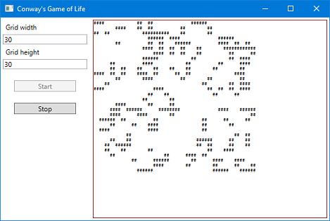

Microsoft announced the general availability of .Net Core 3.0 on the 25th of September 2019; along with [open sourced WPF](https://github.com/dotnet/wpf) now running in .Net Core. I wanted to check out the new WPF and this was my experience.

Before we can check this out, Visual Studio 2019 needed to be upgraded to version 16.3.0. This upgrade also includes the .Net Core 3.0 SDK, so there is no need to install it separately.

## Step 1: Create New (and Blank) WPF .Net Core 3.0 Project

I created a new WPF (.Net Core) project. This will be a simple implementation of [Conway's Game of Life](https://en.wikipedia.org/wiki/Conway%27s_Game_of_Life).


The source for this project is available on GitHub: [dennis-cs-chuah/test-wpf-dotnet-core-30](https://github.com/dennis-cs-chuah/test-wpf-dotnet-core-30)

The first thing I noticed was the WPF designer had gone AWOL. The XAML text editor was there and [Hot Reload](https://docs.microsoft.com/en-us/visualstudio/debugger/xaml-hot-reload?view=vs-2019) worked, but the designer was missing completely. Could it be that Microsoft shipped a faulty version?

After spending some time looking for a solution, I stumbled upon a setting:


Checking the **Use previews of the .NET Core SDK** option and restarting Visual Studio restored the WPF designer. The VS team obviously forgot to unlink the new designer from this setting. Oops!

<div style="border: 1px solid brown; padding: 10px">
<h4>Update</h4>

<p>It seems like Microsoft has realised their mistake and provided an update.</p>

<p>

</p>

</div>


### Project file

The generated WPF .Net Core project file was a lot smaller than WPF .Net Framework project files.

```xml
<Project Sdk="Microsoft.NET.Sdk.WindowsDesktop">
  <PropertyGroup>
    <OutputType>WinExe</OutputType>
    <TargetFramework>netcoreapp3.0</TargetFramework>
    <UseWPF>true</UseWPF>
  </PropertyGroup>
</Project>
```

## Step 2: Test Drive

One of the benefits of .Net Core 3.0 is the upgrade to C# 8; Visual Studio now implicitly uses the latest version of C# based on the selected framework. The Advanced Build Settings dialog in Visual Studio now reflects this change:


See also: [Changes in C# 8.0](https://docs.microsoft.com/en-us/dotnet/csharp/whats-new/csharp-8)

### C# 8.0 Nullable Reference Types

The biggest change touted in C# 8 is the option to turn on static Nullability check. This can be optionally turned on by project or by file.  The migration of large projects could benefit from turning on by file as the file is migrated. For this test, I decided to turn it on for the project, as it was a new project. This is done by adding the `<Nullable>` element to the project and setting it to `enable`.

```xml
<Project Sdk="Microsoft.NET.Sdk.WindowsDesktop">
  <PropertyGroup>
    <OutputType>WinExe</OutputType>
    <TargetFramework>netcoreapp3.0</TargetFramework>
    <UseWPF>true</UseWPF>
    <Nullable>enable</Nullable>
  </PropertyGroup>
</Project>
```

After turning it on, I created the classes `Cell` and `GameGrid`. `GameGrid` essentially contains a grid of `Cell`s. Creating the skeleton class:

```c#
public class GameGrid {
    private readonly byte width;
    private readonly byte height;
    private readonly Cell[,] cells;

    public GameGrid (byte width, byte height) {
        this.width = width;
        this.height = height;
    }
}
```

I noticed that the constructor was highlighted with green underline and a warning produced:


adding the line below to the constructor got rid of the warning.

```c#
cells = new Cell[width + 2, height + 2];
```

I then created a view model:

```c#
public class GameViewModel : INotifyPropertyChanged {
    private GameGrid gameGrid;
    private DispatcherTimer timer;
```

Rightly, both gameGrid and timer were underlined and two warnings generated:


As they are meant to be nullable (only initialised when the game starts), so the declaration was changed to allow nulls, `?`:

```c#
public class GameViewModel : INotifyPropertyChanged {
    private GameGrid? gameGrid;
    private DispatcherTimer? timer;
```

Later when the variables are used:

```c#
public void Stop () {
    timer.Stop ();
    timer = null;
}
```

`timer` was underlined and warning generated:


Adding the null check `?.` removed the warning.

```c#
public void Stop () {
    timer?.Stop ();
    timer = null;
}
```

The static analyser was able to determine that a nullable variable was set to a non-null value and there was no need for null check within the scope:

```c#
    timer = new DispatcherTimer ();
    timer.Tick += Timer_Tick;
    timer.Interval = new TimeSpan (0, 0, intervalSeconds);
    timer.Start ();
```

### C# 8.0 Switch Expression

Another C# enhancement is the Switch Expression. The following method works out [Conway's Game of Life](https://en.wikipedia.org/wiki/Conway%27s_Game_of_Life) rule. Essentially:

1. For a living cell
* If it has less than two living neighbours, it dies (by isolation)
* If it has two or three living neighbours, it continues to live
* If it has more than three living neighbours, it dies (through over population)
2. For a dead cell
* If it has exactly three living neighbours, it becomes alive (through reproduction)

Prior to version 8.0, the rule could be written as:

```c#
public void ShouldBeAlive (IEnumerable<Cell> neighbours) {
    int livingNeighbours = neighbours.Sum (neighbour => neighbour.IsAlive ? 1 : 0);
    switch (livingNeighbours) {
      2 when IsAlive:
      3:
        willBeAlive = true;
        break;
      default:
        willBeAlive = false;
        break;
    }
}
```

(Yes, this could be written as an `if` statement, but `switch` was used here to illistrate a point.) In C# 8.0, this could be simplified to:

```c#
public void ShouldBeAlive (IEnumerable<Cell> neighbours) {
    int livingNeighbours = neighbours.Sum (neighbour => neighbour.IsAlive ? 1 : 0);
    willBeAlive = livingNeighbours switch {
        2 when IsAlive => true,
        3 => true,
        _ => false
    };
}
```

Note that the `switch` comes after the variable and it returns a value. The discard character, `_`, acts as the `default` clause.


## Step 3: Putting it all together

### GUI

There are no new controls in WPF .Net Core 3. So a really simple GUI was created for this test. There are two `TextBox`es to input the size of the grid and **Start** and **Stop** buttons. A `TextBlock` displayed the grid of cells; each living cell is reppresented by two hash characters **##**.

### Model

The `Cell` class as the following signature:

```c#
public class Cell {
    public Cell (bool isAlive);
    public bool IsAlive { get; }
    public void ShouldBeAlive (IEnumerable<Cell> neighbours);
    public void ApplyNextState ();
}
```

and a grid of cells:

```c#
public class GameGrid {
    public GameGrid (byte width, byte height);
    public void NextIteration ();
    public IEnumerable<IEnumerable<Cell>> GetCells ();
}
```

The source for this project is available on GitHub: [dennis-cs-chuah/test-wpf-dotnet-core-30](https://github.com/dennis-cs-chuah/test-wpf-dotnet-core-30)

### ViewModel

A view model was created and bound to the GUI:

```c#
public class GameViewModel : INotifyPropertyChanged {
    public byte Width { get; set; }
    public byte Height { get; set; }
    public bool IsStarted { get; }
    public bool IsStopped { get; }
    public string Display { get; }
    public void Start (int intervalSeconds = 1);
    public void Stop ();
}
```

```xml
    <StackPanel Grid.Column="0" Orientation="Vertical" Margin="4 4 6 4">
        <Label Content="Grid width"/>
        <TextBox Text="{Binding ViewModel.Width, Mode=TwoWay, ValidatesOnExceptions=True, ValidatesOnDataErrors=True, FallbackValue=30}"/>
        <Label Content="Grid height"/>
        <TextBox Text="{Binding ViewModel.Height, Mode=TwoWay, ValidatesOnExceptions=True, ValidatesOnDataErrors=True, FallbackValue=30}"/>
        <Button Content="Start" Margin="20 20 20 0" Click="StartGame" IsEnabled="{Binding ViewModel.IsStopped, Mode=OneWay}"/>
        <Button Content="Stop" Margin="20 20 20 0" Click="StopGame" IsEnabled="{Binding ViewModel.IsStarted, Mode=OneWay}"/>
    </StackPanel>
    <ScrollViewer Margin="4" Grid.Column="1" HorizontalScrollBarVisibility="Auto" VerticalScrollBarVisibility="Auto">
        <Border BorderThickness="1" BorderBrush="Brown">
            <TextBlock Text="{Binding ViewModel.Display, Mode=OneWay}" TextWrapping="Wrap" FontFamily="Courier New" FontSize="6pt"/>
        </Border>
    </ScrollViewer>
```

`TextBox` validations:

```xml
    <Window.Resources>
        <Style TargetType="TextBox">
            <Style.Triggers>
                <Trigger Property="Validation.HasError" Value="true">
                    <Setter Property="ToolTip" Value="{Binding RelativeSource={x:Static RelativeSource.Self}, Path=(Validation.Errors)[0].ErrorContent}"/>
                </Trigger>
            </Style.Triggers>
        </Style>
    </Window.Resources>
```

### Unit test

Example of a unit test using [NUit](https://nunit.org/) ([Nuget package](https://www.nuget.org/packages/NUnit/))

```c#
private static readonly object[] TEST_CASES = new object[] {
    // Living cell, 2, or 3 neighbours -> continue to be alive
    new object[] { true, 0, false },
    new object[] { true, 1, false },
    new object[] { true, 2, true },
    new object[] { true, 3, true },
    new object[] { true, 4, false },
    new object[] { true, 5, false },
    new object[] { true, 6, false },
    new object[] { true, 7, false },

    // Dead cell, if exactly 3 neighbours -> will become alive (reproduction)
    new object[] { false, 0, false },
    new object[] { false, 1, false },
    new object[] { false, 2, false },
    new object[] { false, 3, true },
    new object[] { false, 4, false },
    new object[] { false, 5, false },
    new object[] { false, 6, false },
    new object[] { false, 7, false }
};

[TestCaseSource (nameof (TEST_CASES))]
public void TestNextState (bool isAlive, int livingNeighbours, bool expectedToBeAlive) {
    Cell testCell = new Cell (isAlive: isAlive);
    testCell.ShouldBeAlive (Enumerable.
        Range (0, livingNeighbours).
        Select (_ => new Cell (isAlive: true)));
    testCell.ApplyNextState ();
    Assert.AreEqual (expectedToBeAlive, testCell.IsAlive);
}
```

## Step 4 - Run it!



## Step 5 - Tweaking The Output

Doing a **Release** build resulted in a small EXE and DLL pair, approximately 180Kb in total size.

Doing a publish targeting win10-x64 resulted in an EXE / DLL pair of similar size.

### ReadyToRun

This option only works for self contained apps, so not surprisingly, adding ReadyToRun and publishing a self-contained applicaion bloated up the file size to 150Mb!

Turn this option on by adding `<PublishReadyToRun>true</PublishReadyToRun>` in the project file.

### Assembly linking

Another option for self contained apps is *Assembly linking*, essentially a smart linker that only includes libraries that are referenced by the applicaion. Using this setting, the self-contained app size reduced to 85Mb - still a hefty app for what it is doing.

Turn this option on by adding `<PublishTrimmed>true</PublishTrimmed>` in the project file.

### Single file executables

This is a more useful feature. Turn this option on either by adding `<PublishSingleFile>true</PublishSingleFile>` in the project file or through `dotnet publish /p:PublishSingleFile=true`. This option requires the runtime to also be specified.

Adding these options to the project file means only one runtime can be targeted. Using the `dotnet publish` method, different executables could be created for each targeted runtime.

Publishing to win10-x64 created a single EXE file of around 180Kb. When this is run for t first time, it will unpack its dependent files into a temporary folder - in `AppData\Local\Temp\.net`.

## Rounding up

For this simple example, it seems like the features of WPF has been successfully migrated over to .Net Core. Whilst WPF still only runs on Windows, there is the added benefit of C# 8, plus Microsoft had said that .Net Framework 4.8 will be the last version. All future development will be in .Net Core. It makes sense that any new projects should target .Net Core.

<div style="border: 1px solid brown; padding: 10px">
<h4>Update</h4>

<p>I have since found the static nullability checker to be bit aggressive.</p>


</div>


